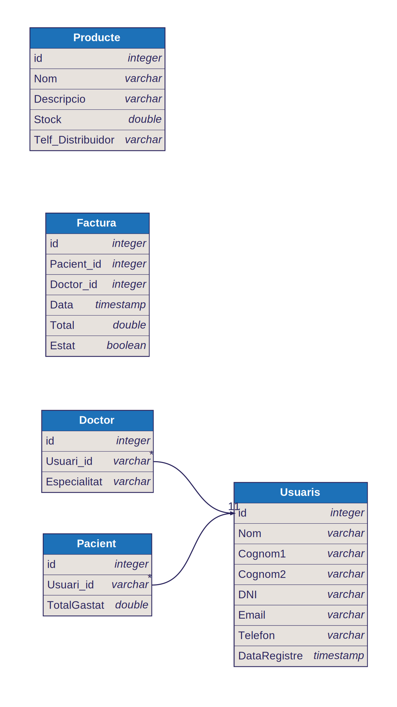

# Prova Tècnica

## Pregunta 1

> 1. Analiza el siguiente fragmento de código e identifica los bugs presentes,
>    proponiendo las correcciones necesarias.

```csharp
using System;
using System.Threading.Tasks;

class Program
{
    static async Task Main(string[] args)
    {
        Console.WriteLine("Starting program...");

        string input = null;
        Console.WriteLine("Input length: " + input.Length);

        int result = await GetNumberAsync();
        Console.WriteLine("Result: " + result);
    }

    static async Task<int> GetNumberAsync()
    {
         Task.Run(async () =>
        {
            await Task.Delay(1000);
            return 42;
        });

        return 0;
    }
}

```

Hi ha un parell de coses a comentar:

### Problema 1

```csharp
 string input = null;
 Console.WriteLine("Input length: " + input.Length);
```

Com que es declara aquesta string amb un valor null, al intentar accedir a la propietat .Length, donarà una Null Reference Exception. Possibles solucions: potser la intenció era capturar un input a través d'un `Console.ReadLine();` abans d'imprimir per pantalla la longitud d'aquest input.

### Problema 2

```csharp
static async Task<int> GetNumberAsync()
{
      Task.Run(async () =>
    {
        await Task.Delay(1000);
        return 42;
    });

    return 0;
}
```

Aquesta funció sempre retornarà 0. En cas de voler que es retorni el valor 42, s'hauran de fer un parell de canvis:

- Esperar a que acabi el bloc `Task.Run` amb un `await`

- Capturar aquest valor en una variable i fer el return d'aquesta.

Per exemple:

```csharp
int myValue = await Task.Run(...);
return myValue;
```

O bé, directament:

```csharp
return await Task.Run(...);
```

## Pregunta 2

> Diseña un diagrama de base de datos para una aseguradora de salud
> que almacene información sobre sus usuarios, incluyendo tanto
> pacientes como doctores. Además, el sistema debe gestionar la
> facturación y el inventario de la aseguradora.

Aquest disseny és una interepretació minimalista del problema.

En el cas dels doctors i dels pacients, els hi poso una clau forana `usuari_id` i una clau primària `doctor_id` i `pacient_id` però en un cas pràctic, es podria fer amb una sola (`usuari_id`) i que fos forana i primària alhora.

### Taules

```
-----
Usuari
-----
id [PK]
Nom
Cognom1
Cognom2
DNI
Genere
Email
Telefon
...

----
Doctor
----
Doctor_id [PK]
Usuari_id [FK > Usuari.id]
Especialitat
...

----
Pacient
----
Pacient_id [PK]
Usuari_id [FK > Usuari.id]
TotalGastat
...

----
Factura
----
id [PK]
Pacient_id [FK > Pacient.Pacient_id]
Doctor_id [FK > Doctor.Doctor_id]
Data
Total
Estat

----
Producte
----
id [PK]
Nom
Descripcio
Preu_Unitari
Stock
Telf_Distribuidor
...
```

Partint d'aquesta base, el diagrama seria així:



## Pregunta 3

> Con base en el diagrama de base de datos diseñado, elabora una
> consulta en LINQ que permita obtener el porcentaje de pacientes
> masculinos y femeninos.

Donades les següents classes `Usuari` i `Dades` i omplint la base de dades amb 4 homes i 6 dones (per demostrar el funcionament)

```csharp
    public class Usuari
    {
        public int Id { get; set; }
        public string Nom { get; set; }
        public string Cognom { get; set; }
        public int Genere { get; set; } // 0 = female, 1 = male
    }

    public class Dades
    {
    public List<Usuari> dades { get; set; }
    public Dades()
        {
        //Inicialitzo i omplo les dades així per poder fer una demostració minimalista ...
        dades = new List<Usuari>();
        dades.Add(new Usuari { Id = 1, Nom = "Edu", Cognom = "M. Busquets", Genere = 0 });
        dades.Add(new Usuari { Id = 2, Nom = "Joan", Cognom = "Bongo", Genere = 0 });
        dades.Add(new Usuari { Id = 3, Nom = "Biel", Cognom = "Bingo", Genere = 0 });
        dades.Add(new Usuari { Id = 4, Nom = "Martí", Cognom = "Bango", Genere = 0 });
        dades.Add(new Usuari { Id = 5, Nom = "Marta", Cognom = "Preciosa", Genere = 1 });
        dades.Add(new Usuari { Id = 6, Nom = "Martina", Cognom = "Pinpina", Genere = 1 });
        dades.Add(new Usuari { Id = 7, Nom = "Emma", Cognom = "Ferrer", Genere = 1 });
        dades.Add(new Usuari { Id = 8, Nom = "Ona", Cognom = "Marítima", Genere = 1 });
        dades.Add(new Usuari { Id = 9, Nom = "Sofia", Cognom = "Filo", Genere = 1 });
        dades.Add(new Usuari { Id = 10, Nom = "Olívia", Cognom = "Oil", Genere = 1 });
        }
    }

```

Podem fer això:

```csharp
static void Main(string[] args)
{
    var db = new Dades();
    double percentFemeni = 0;
    double percentMasculi = 0;
    if (db.dades.Any())
    {
        //Tres passos
        double usuarisTotals = db.dades.Count();
        double dones = db.dades.Count(u => u.Genere == 1);
        double percentatge = dones / usuarisTotals * 100;

        // En una sola línia. Importantíssim el cast de double davant del db.dades.Count(..)
        percentFemeni = (double)db.dades.Count(usuari => usuari.Genere == 1) / db.dades.Count() * 100;

        // També pels homes:
        percentMasculi = (double)db.dades.Count(usuari => usuari.Genere == 0) / db.dades.Count() * 100;
    }
    Console.WriteLine($"El percentatge de noies/dones a la llista és de: {percentFemeni:F2}%");
    Console.WriteLine($"El percentatge de nois/homes a la llista és de: {percentMasculi:F2}%");


    //Comprovació de que els dos valors sumen 100
    Console.WriteLine($"{percentFemeni+percentMasculi}%");

}
```

Per consola, doncs, es veu:

```
El percentatge de noies/dones a la llista és de: 60,00%
El percentatge de nois/homes a la llista és de: 40,00%
100%
```

## Pregunta 4

> Desarrolla una consulta en LINQ que permita calcular la facturación
> generada por cada doctor registrado en el sistema.

Per aquesta pregunta cal fer el plantejament següent:

- No tenim guardat el valor total de les factures generades dins de la taula `Doctor`

- Cada factura té un camp `Doctor_Id` que podem utilitzar per fer un sumatori de totes les factures que tinguin aquest camp igual.

- En el meu cas d'exemple, no tinc una llista de `doctors`: només una llista d' `usuaris`

Per fer una consulta sense LINQ, pas a pas es voldria fer algo així:

```csharp
foreach (Usuari usuari in db.Usuaris)
{
    if (usuari is Doctor doctor)
    {
        double facturacioDoctor = 0;
        foreach (Factura f in factures)
        {
            if (f.Doctor_Id == doctor.Id)
            {
                facturacioDoctor += f.Import;
            }
        }
        Console.WriteLine($"{doctor.Id} -- {doctor.Nom} -- {facturacioDoctor:F2} €");
    }
}
```

"Mirem cada usuari. Si aquest usuari és doctor, en fem un cast. Ens guardem la seva id. Ara mirem tota la col·lecció de factures. Mirem cada una d'elles. Si coincideix factura.Doctor_Id amb doctor.Id, sumem aquest valor a una variable que prèviament hem inicialitzat a 0. Quan acabem amb aquest doctor, seguim buscant a la llista d'usuaris fins a trobar el següent doctor, i repetim fins acabar la llista."

Aquest plantejament és perfectament vàlid per una base de dades petita, però no sempre serà el cas. En quant a potència (potser no tant fàcil de llegir), millor així amb LINQ:

```csharp
Console.WriteLine($"Query de LINQ, fent servir un nou objecte anònim: ");

db.Usuaris
    .OfType<Doctor>()
    .Select(doctor => new {
        doctor.Id,
        doctor.Nom,
        FacturacioTotal = db.Factures
            .Where(f => f.Doctor_Id == doctor.Id)
            .Sum(f => f.Import)
    })
    .ToList()
    .ForEach(d => Console.WriteLine($"{d.Id} -- {d.Nom} -- {d.FacturacioTotal:F2} €"));
```

o potser un punt entremig, depenent del projecte, fet d'una manera més fàcil de llegir i possiblement mantenir o debugar:

```csharp
foreach (Usuari usuari in db.Usuaris)
{
    if (usuari is Doctor doctor)
    {
        double facturacioDoctor =
            db.Factures
            .Where(factura => factura.Doctor_Id == doctor.Id)
            .Sum(fact => fact.Import);
        Console.WriteLine($"{doctor.Id} -- {doctor.Nom} -- {facturacioDoctor:F2} €");


    }
}
```

##Pregunta 5

> 5. Implementa una API REST que permita realizar operaciones CRUD
>    (crear, leer, actualizar y eliminar) sobre la entidad de Inventario.

Per tal de poder emmagatzemar dades, he fet servir una base de dades SQLite.

--
