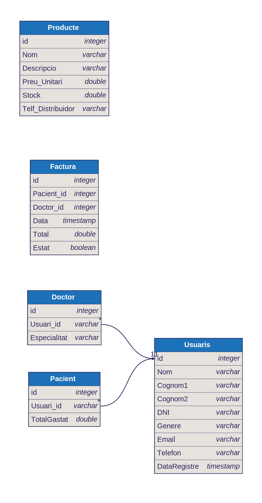

# Prova Tècnica

## Pregunta 1

> 1. Analiza el siguiente fragmento de código e identifica los bugs presentes,
>    proponiendo las correcciones necesarias.

```csharp
using System;
using System.Threading.Tasks;

class Program
{
    static async Task Main(string[] args)
    {
        Console.WriteLine("Starting program...");

        string input = null;
        Console.WriteLine("Input length: " + input.Length);

        int result = await GetNumberAsync();
        Console.WriteLine("Result: " + result);
    }

    static async Task<int> GetNumberAsync()
    {
         Task.Run(async () =>
        {
            await Task.Delay(1000);
            return 42;
        });

        return 0;
    }
}

```

Hi ha un parell de coses a comentar:

### Problema 1

```csharp
 string input = null;
 Console.WriteLine("Input length: " + input.Length);
```

Com que es declara aquesta string amb un valor null, al intentar accedir a la propietat .Length, donarà una Null Reference Exception. Possibles solucions: potser la intenció era capturar un input a través d'un `Console.ReadLine();` abans d'imprimir per pantalla la longitud d'aquest input.

### Problema 2

```csharp
static async Task<int> GetNumberAsync()
{
      Task.Run(async () =>
    {
        await Task.Delay(1000);
        return 42;
    });

    return 0;
}
```

Aquesta funció sempre retornarà 0. En cas de voler que es retorni el valor 42, s'hauran de fer un parell de canvis:

- Esperar a que acabi el bloc `Task.Run` amb un `await`

- Capturar aquest valor en una variable i fer el return d'aquesta.

Per exemple:

```csharp
int myValue = await Task.Run(...);
return myValue;
```

O bé, directament:

```csharp
return await Task.Run(...);
```

## Pregunta 2

> Diseña un diagrama de base de datos para una aseguradora de salud
> que almacene información sobre sus usuarios, incluyendo tanto
> pacientes como doctores. Además, el sistema debe gestionar la
> facturación y el inventario de la aseguradora.

Aquest disseny és una interepretació minimalista del problema.

En el cas dels doctors i dels pacients, els hi poso una clau forana `usuari_id` i una clau primària `doctor_id` i `pacient_id` però en un cas pràctic, es podria fer amb una sola (`usuari_id`) i que fos forana i primària alhora.

### Taules

```
-----
Usuari
-----
id [PK]
Nom
Cognom1
Cognom2
DNI
Email
Telèfon
...

----
Doctor
----
Doctor_id [PK]
Usuari_id [FK > Usuari.id]
Especialitat
...

----
Pacient
----
Pacient_id [PK]
Usuari_id [FK > Usuari.id]
TotalGastat
...

----
Factura
----
id [PK]
Pacient_id [FK > Pacient.Pacient_id]
Doctor_id [FK > Doctor.Doctor_id]
Data
Total
Estat

----
Producte
----
id [PK]
Nom
Descripcio
Stock
Telf_Distribuidor
...
```

Partint d'aquesta base, el diagrama seria així:


